  

 

# Hey, I'm Freddy Nyanda 👋 🇹🇿

**Data Scientist · ML Engineer · Builder of things that matter**  
*Dar es Salaam, Tanzania 🌍*

---

## 🚀 About Me

Passionate about turning raw data into intelligent systems. I build end-to-end pipelines, train production-grade models, and automate deployment workflows that deliver measurable business impact.

- 🎯 Open to Data Science / ML Engineering opportunities — remote or hybrid
- ☁️ Building strongly on Azure ML and production MLOps patterns
- ⚡ Stack focus: PySpark → LightGBM → FastAPI → Docker → GitHub Actions → Azure
- 📬 Reach me: [freddynyanda@proton.me](mailto:freddynyanda@proton.me)

---

## 📫 Connect

---

## 📈 Impact Snapshot

Replace the values below with your verified numbers from real projects.

- ✅ Built and automated **[X]** production data/ML pipelines
- ✅ Reduced manual reporting effort by **[X]%** through automation
- ✅ Deployed **[X]** ML-powered applications to cloud environments
- ✅ Improved model or forecasting performance by **[X]%** on key use-cases
- ✅ Designed CI/CD workflows running every **[X]** minutes/hours with zero-touch updates

---

## 🛠️ Core Stack

**Languages & Big Data**

**ML & Data Science**

**MLOps · Cloud · DevOps**

---

## 📊 GitHub Stats

 

---

## 🌟 Featured Projects

### 📈 [EA Financial Tracker](https://github.com/nyandajr/ea-financial-tracker)

**Problem:** Real-time East African currency and crypto movements are hard to monitor consistently.  
**Solution:** Built an automated forecasting and tracking pipeline for USD/TZS, USD/KES, USD/UGX, USD/EUR plus BTC, ETH, BNB with scheduled CI/CD updates.  
**Impact:** Zero-touch hourly refresh with always-updated visual insights.

Tech: Python · GitHub Actions · Streamlit · ML · CI/CD  
🔴 Live: [ea-financial-tracker.streamlit.app](https://ea-financial-tracker.streamlit.app)

---

### 📰 [East Africa News Sentiment](https://github.com/nyandajr/East_Africa_News_Sentiment)

**Problem:** News sentiment shifts quickly and manually tracking mood trends is inefficient.  
**Solution:** Automated scraping + VADER sentiment scoring + trend dashboards running fully on GitHub Actions.  
**Impact:** Continuous sentiment intelligence with no manual intervention.

Tech: Python · NLP · VADER · Streamlit · GitHub Actions  
🔴 Live: [eastafricanewssentiment.streamlit.app](https://eastafricanewssentiment.streamlit.app)

---

### 🚗 Car Price Predictor TZ

**Problem:** Vehicle pricing in local markets can be inconsistent and hard to benchmark.  
**Solution:** Trained LightGBM model, exposed through FastAPI, containerized with Docker, CI/CD-ready and Azure-ready.  
**Impact:** Faster, data-driven pricing estimates for the Tanzania auto market.

Tech: LightGBM · FastAPI · Docker · GitHub Actions · Azure · MLOps

---

### 💳 [Credit Card Customer Segmentation](https://github.com/nyandajr/credit-card-segmentation)

**Problem:** Customer behavior heterogeneity reduces effectiveness of one-size-fits-all strategies.  
**Solution:** Applied K-Means clustering on 8,950 customers with full EDA and behavioral profiling.  
**Impact:** Identified actionable customer groups for targeting and retention.

Tech: Python · Scikit-learn · K-Means · EDA · Matplotlib

---

## 🎯 Current Focus

- Production model monitoring and drift-aware ML systems
- Azure-based MLOps architecture and deployment patterns
- High-reliability data + inference pipelines with CI/CD

---

"Build in silence. Let the commits speak."

